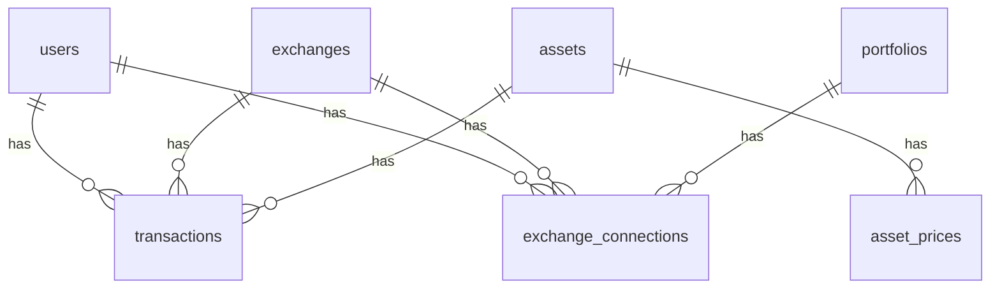

# Crypto Portfolio App

## 概要

複数の仮想通貨取引所に分散している資産を一元管理するアプリです。

- 通貨ごとの保有量
- 平均取得単価
- 現在価格
- 損益

を一画面で確認できます。

---

## ダッシュボード


---

## ローカル起動手順

1. **リポジトリを取得**

   ```bash
   git clone <このリポジトリの URL>
   cd cryptoapp
   ```

2. **PHP 依存関係**

   ```bash
   composer install
   ```

3. **フロントエンド依存関係**

   ```bash
   npm install
   ```

4. **環境変数**

   ```bash
   cp .env.example .env
   php artisan key:generate
   ```

   `.env` の **`DB_*`** を PostgreSQL に合わせて設定する（`.env.example` のコメント参照）。DB とユーザー `cryptoapp_app` をまだ作っていない場合は、PostgreSQL でロール・データベースを作成してから `migrate` してください。

5. **マイグレーション**

   ```bash
   php artisan migrate
   ```

   （任意）非本番でデモデータを入れる場合: `php artisan db:seed --class=DemoSeeder`

6. **開発サーバー（別ターミナルで実行）**

   ```bash
   npm run dev
   ```

   ```bash
   php artisan serve
   ```

7. ブラウザで `http://127.0.0.1:8000` を開く。

---

## デモ

未ログインで画面だけ確認する場合:

```text
http://127.0.0.1:8000/demo
```

デモユーザーでログインして操作する場合は、非本番環境でデモデータを投入します。

```bash
php artisan db:seed --class=DemoSeeder
```

ログイン情報:

- メールアドレス: `demo@example.com`
- パスワード: `password`

---

## 主な機能

- 取引履歴の登録（購入価格・数量）
- 通貨ごとの資産集計
- 現在価格の取得（API 連携）
- 損益の自動計算
- 取引所別の管理
- bitFlyer 約定履歴の同期（読み取り専用 API キー）

---

## bitFlyer 連携

bitFlyer の読み取り専用 API キーを登録すると、bitFlyer の Market List API で取得できる JPY 建て Spot 商品の約定履歴を取引履歴へ取り込めます。

1. bitFlyer 側で読み取り専用 API キーを作成する
2. ログイン後、上部ナビの「連携」を開く
3. 同期先ポートフォリオ、API Key、API Secret を登録する
4. 「同期」を押して約定履歴を取り込む

CLI でも登録・同期できます。

```bash
php artisan bitflyer:connect demo@example.com <portfolio_id>
php artisan bitflyer:sync-executions
```

発注、取消、出金系の権限が付いた API キーは登録時に拒否されます。BTC 建て商品は JPY 換算が別途必要なため対象外です。詳しい運用手順は [docs/bitflyer-sync.md](docs/bitflyer-sync.md) を参照してください。

定期同期を使う場合はスケジューラを起動してください。

```bash
php artisan schedule:work
```

## bitbank 連携

bitbank の API キーを登録すると、bitbank の Pair List API で取得できる有効な JPY 建て現物ペアの約定履歴を取引履歴へ取り込めます。

```bash
php artisan bitbank:connect demo@example.com <portfolio_id>
php artisan bitbank:sync-executions
```

bitbank API では権限一覧を取得できないため、登録時は読み取りAPIの疎通だけを確認します。APIキーには売買・出金権限を付けないでください。詳しい運用手順は [docs/bitbank-sync.md](docs/bitbank-sync.md) を参照してください。

## Coincheck 連携

Coincheck の API キーを登録すると、Coincheck 取引所の JPY 建てペアの取引履歴を取引履歴へ取り込めます。

```bash
php artisan coincheck:connect demo@example.com <portfolio_id>
php artisan coincheck:sync-executions
```

APIキーには読み取りに必要な権限だけを付与し、売買・送金権限を付けないでください。詳しい運用手順は [docs/coincheck-sync.md](docs/coincheck-sync.md) を参照してください。

---

## 使用技術

- Laravel
- PostgreSQL
- Inertia.js・React
- Tailwind CSS・Vite
- 外部 API（CoinGecko 価格取得、bitFlyer 約定履歴同期）

---

## ER図


