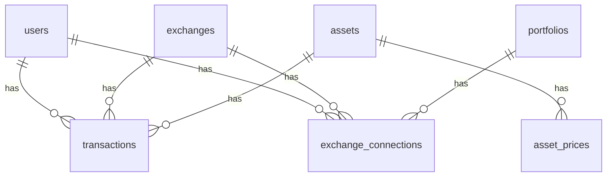

# Crypto Portfolio App

## 概要

複数の仮想通貨取引所に分散している資産を一元管理するアプリです。

- 通貨ごとの保有量
- 平均取得単価
- 現在価格
- 損益

を一画面で確認できます。

---

## ダッシュボード


---

## ローカル起動手順

1. **リポジトリを取得**

   ```bash
   git clone <このリポジトリの URL>
   cd cryptoapp
   ```

2. **PHP 依存関係**

   ```bash
   composer install
   ```

3. **フロントエンド依存関係**

   ```bash
   npm install
   ```

4. **環境変数**

   ```bash
   cp .env.example .env
   php artisan key:generate
   ```

   `.env` の **`DB_*`** を PostgreSQL に合わせて設定する（`.env.example` のコメント参照）。DB とユーザー `cryptoapp_app` をまだ作っていない場合は、PostgreSQL でロール・データベースを作成してから `migrate` してください。

5. **マイグレーション**

   ```bash
   php artisan migrate
   ```

   （任意）非本番でデモデータを入れる場合: `php artisan db:seed --class=DemoSeeder`

6. **開発サーバー（別ターミナルで実行）**

   ```bash
   npm run dev
   ```

   ```bash
   php artisan serve
   ```

7. ブラウザで `http://127.0.0.1:8000` を開く。

---

## デモ

未ログインで画面だけ確認する場合:

```text
http://127.0.0.1:8000/demo
```

デモユーザーでログインして操作する場合は、非本番環境でデモデータを投入します。

```bash
php artisan db:seed --class=DemoSeeder
```

ログイン情報:

- メールアドレス: `demo@example.com`
- パスワード: `password`

---

## 主な機能

- 取引履歴の登録（購入価格・数量）
- 通貨ごとの資産集計
- 現在価格の取得（API 連携）
- 損益の自動計算
- 取引所別の管理
- bitFlyer 約定履歴の同期（読み取り専用 API キー）
- bitbank / Coincheck / GMOコイン / Zaif / Binance Japan の約定履歴同期

---

## 取引所 API 連携の仕組み

ユーザーが各取引所にログインし、取引所の設定画面で API Key / API Secret を発行します。その API Key / API Secret をこのアプリの「連携」画面に登録すると、アプリが取引所 API から売買済みの約定履歴を取得し、取引履歴へ反映します。

このアプリに取引所のログインIDやパスワードを入力する必要はありません。登録するのは、取引所が発行した API Key / API Secret だけです。

APIキーは必ず読み取り専用、または約定履歴・残高確認に必要な最小権限で作成してください。売買、注文取消、送金、出金などの更新権限は不要です。API Secret は保存時に暗号化され、`.env` や Git には保存しません。

連携登録時に、API同期で取り込む開始日を選択できます。

- 今日から: 新規利用開始後の売買だけを同期します
- 過去分も含める: 取引所APIで取得できる範囲を取り込みます
- 日付指定: 指定日以降の売買だけを同期します

取引所APIで取得できない古い履歴や、取り込み対象外の履歴は、取引履歴画面から手動で追加・編集・削除できます。

---

## bitFlyer 連携

bitFlyer の読み取り専用 API キーを登録すると、bitFlyer の Market List API で取得できる JPY 建て Spot 商品の約定履歴を取引履歴へ取り込めます。

1. bitFlyer 側で読み取り専用 API キーを作成する
2. ログイン後、上部ナビの「連携」を開く
3. 同期先ポートフォリオ、API Key、API Secret を登録する
4. 「同期」を押して約定履歴を取り込む

CLI でも登録・同期できます。

```bash
php artisan bitflyer:connect demo@example.com <portfolio_id>
php artisan bitflyer:sync-executions
```

発注、取消、出金系の権限が付いた API キーは登録時に拒否されます。BTC 建て商品は JPY 換算が別途必要なため対象外です。詳しい運用手順は [docs/bitflyer-sync.md](docs/bitflyer-sync.md) を参照してください。

定期同期を使う場合はスケジューラを起動してください。

```bash
php artisan schedule:work
```

## bitbank 連携

bitbank の API キーを登録すると、bitbank の Pair List API で取得できる有効な JPY 建て現物ペアの約定履歴を取引履歴へ取り込めます。

```bash
php artisan bitbank:connect demo@example.com <portfolio_id>
php artisan bitbank:sync-executions
```

bitbank API では権限一覧を取得できないため、登録時は読み取りAPIの疎通だけを確認します。APIキーには売買・出金権限を付けないでください。詳しい運用手順は [docs/bitbank-sync.md](docs/bitbank-sync.md) を参照してください。

## Coincheck 連携

Coincheck の API キーを登録すると、Coincheck 取引所の JPY 建てペアの取引履歴を取引履歴へ取り込めます。

```bash
php artisan coincheck:connect demo@example.com <portfolio_id>
php artisan coincheck:sync-executions
```

APIキーには読み取りに必要な権限だけを付与し、売買・送金権限を付けないでください。詳しい運用手順は [docs/coincheck-sync.md](docs/coincheck-sync.md) を参照してください。

## GMOコイン 連携

GMOコインの API キーを登録すると、GMOコインの現物約定履歴を取引履歴へ取り込めます。

```bash
php artisan gmo-coin:connect demo@example.com <portfolio_id>
php artisan gmo-coin:sync-executions
```

APIキーには読み取りに必要な権限だけを付与し、売買・出金権限を付けないでください。GMOコインの最新約定 API は直近の履歴が対象のため、過去分の初回バックフィルは CSV インポートなど別経路で扱う必要があります。詳しい運用手順は [docs/gmo-coin-sync.md](docs/gmo-coin-sync.md) を参照してください。

## Zaif 連携

Zaif の API キーを登録すると、Zaif Orderbook Trading の JPY 建て現物約定履歴を取引履歴へ取り込めます。

```bash
php artisan zaif:connect demo@example.com <portfolio_id>
php artisan zaif:sync-executions
```

APIキーには `info` 権限だけを付与し、売買・出金権限を付けないでください。かんたん売買など API で取得できない履歴は、取引履歴画面から手動で追加してください。詳しい運用手順は [docs/zaif-sync.md](docs/zaif-sync.md) を参照してください。

## Binance Japan 連携

Binance Japan の API キーを登録すると、Binance Spot API で取得できる JPY 建て現物約定履歴を取引履歴へ取り込めます。

```bash
php artisan binance:connect demo@example.com <portfolio_id>
php artisan binance:sync-executions
```

APIキーには読み取りに必要な権限だけを付与し、売買・出金権限を付けないでください。`sync-start-date=all` の場合は API が返す直近履歴が対象です。完全な過去分バックフィルや Spot API で取得できない Convert・販売所・Earn などの履歴は、CSV インポートや手動登録で補完してください。詳しい運用手順は [docs/binance-sync.md](docs/binance-sync.md) を参照してください。

---

## 今後の対応予定・未対応取引所

取引所 API 連携は、公式 API で約定履歴を取得できること、読み取り専用または最小権限の API キーで運用できること、モックテストで同期処理を検証できることを前提に順次追加します。

現時点の対応状況:

- 対応済み: bitFlyer、bitbank、Coincheck、GMOコイン、Zaif
- 未対応: Binance、Coinbase、Kraken、Bybit、OKX、Bitget、KuCoin、Gate.io
- API仕様確認待ち: SBI VC Trade
- API利用不可のため保留: BITPOINT
- サービス終了のため対象外: DMM Bitcoin

今後追加する取引所では、最初に API 仕様、取得できる履歴の範囲、レート制限、必要権限、テスト方法を確認します。API で取得できない過去履歴や販売所・簡単売買の履歴は、手動 CRUD または CSV インポートで補完する方針です。

---

## 使用技術

- Laravel
- PostgreSQL
- Inertia.js・React
- Tailwind CSS・Vite
- 外部 API（CoinGecko 価格取得、各取引所の約定履歴同期）

---

## ER図


