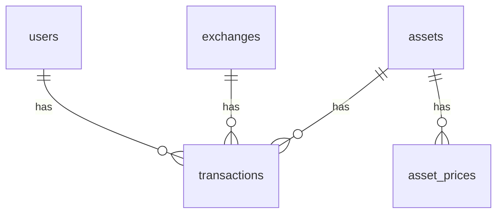

# Crypto Portfolio App

## 概要

複数の仮想通貨取引所に分散している資産を一元管理するアプリです。

- 通貨ごとの保有量
- 平均取得単価
- 現在価格
- 損益

を一画面で確認できます。

---

## ダッシュボード


---

## ローカル起動手順

1. **リポジトリを取得**

   ```bash
   git clone <このリポジトリの URL>
   cd cryptoapp
   ```

2. **PHP 依存関係**

   ```bash
   composer install
   ```

3. **フロントエンド依存関係**

   ```bash
   npm install
   ```

4. **環境変数**

   ```bash
   cp .env.example .env
   php artisan key:generate
   ```

   `.env` の **`DB_*`** を PostgreSQL に合わせて設定する（`.env.example` のコメント参照）。DB とユーザー `cryptoapp_app` をまだ作っていない場合は、PostgreSQL でロール・データベースを作成してから `migrate` してください。

5. **マイグレーション**

   ```bash
   php artisan migrate
   ```

   （任意）非本番でデモデータを入れる場合: `php artisan db:seed --class=DemoSeeder`

6. **開発サーバー（別ターミナルで実行）**

   ```bash
   npm run dev
   ```

   ```bash
   php artisan serve
   ```

7. ブラウザで `http://127.0.0.1:8000` を開く。

---

## 主な機能

- 取引履歴の登録（購入価格・数量）
- 通貨ごとの資産集計
- 現在価格の取得（API 連携）
- 損益の自動計算
- 取引所別の管理

---

## 使用技術

- Laravel
- PostgreSQL
- Inertia.js・React
- Tailwind CSS・Vite
- 外部 API（価格取得）

---

## ER図


